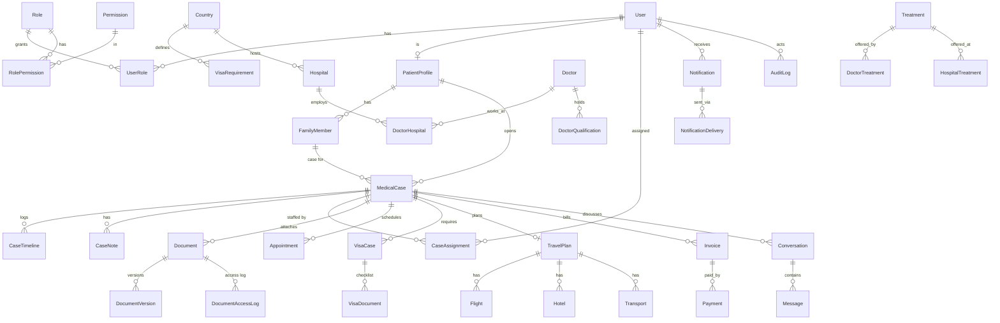

# 01 — System Architecture

## Decisions

| Concern | Choice | Why |
|---|---|---|
| Frontend | Next.js (App Router) + TypeScript, Tailwind, small hand-rolled UI kit (`packages/ui`) on Radix primitives only where needed | Server-rendered/static public pages for SEO and speed; portals are client-light |
| Data fetching | Server Components for public pages; TanStack Query only inside portals | No global state library |
| Forms | React Hook Form + Zod (schemas shared from `packages/validation`) | Same validation on client and server |
| Backend | **NestJS** (modular monolith), REST | Guards/interceptors map cleanly to RBAC + audit; modules can later be split out |
| DB | PostgreSQL 16 + Prisma 6 | Relational, FK/unique/index enforced |
| Cache / queues | Redis (rate-limit counters, session revocation list, BullMQ for notifications & virus-scan jobs) | |
| Files | S3-compatible private bucket (MinIO locally, S3/R2 in prod), SSE enabled | Bytes never in DB |
| Realtime | Socket.IO gateway in the API (Phase 3), auth by the same access token | |
| Monorepo | npm workspaces (`apps/*`, `packages/*`) | pnpm is not installed on the dev machine; can migrate later |

The API is the **only** component that touches Postgres, Redis and object storage. The web app never holds DB or storage credentials.

## Runtime topology

```
Browser ──► Cloudflare (CDN, WAF, TLS) ──► Nginx (TLS, gzip/br, rate limit, security headers)
                                              ├──► web  (Next.js, SSR/ISR)     :3000
                                              └──► api  (NestJS, REST + WS)    :4000
                                                        ├──► PostgreSQL
                                                        ├──► Redis
                                                        └──► Object storage (private bucket)
                                                   worker (same image, BullMQ consumers:
                                                           notifications, AV scan, reminders)
```

* Public pages: static/ISR, cached at CDN. Portals: `Cache-Control: private, no-store`.
* Web → API calls go server-to-server for SSR (internal network) and browser → `/api` (same-site, via nginx) for portals, so cookies stay first-party.

## Module map (API)

`auth · users · rbac · patients · family-members · directory (countries, cities, hospitals, doctors, treatments, specialties) · cases · documents · appointments · visa · travel · payments · messaging · notifications · audit · cms · reports · search · admin`

Each module: `controller → service → repository (Prisma)`; DTOs validated by Zod (`nestjs-zod`); cross-module calls only through exported services. Cross-cutting: `AuthGuard`, `PermissionsGuard`, `ScopeService` (object-level access), `AuditInterceptor`, `ResponseInterceptor`, `AllExceptionsFilter`.

## Data model (ERD, high level)

Full definition: [`apps/api/prisma/schema.prisma`](../apps/api/prisma/schema.prisma) (64 models).



Design rules applied: UUID PKs; `createdAt/updatedAt` everywhere (audit/access logs are append-only, so `createdAt` only); soft delete (`deletedAt`) on users, patients, family members, cases, documents, directory entities; `Restrict` on clinical/financial FKs, `Cascade` only for pure child rows; join tables for every many-to-many (no JSON blobs — `Json` is used only for audit before/after snapshots).

## Deployment architecture

* **Local**: `infra/docker-compose.yml` → postgres, redis, minio (apps run with `npm run dev`). Phase 1 adds web/api/nginx containers.
* **Production** (single VM → scalable): nginx + web + api + worker as containers behind Cloudflare; managed Postgres with PITR; managed Redis; S3/R2 bucket with versioning + lifecycle retention; secrets from the platform secret manager (never in images).
* Multi-stage Docker builds (`deps → build → runtime`), non-root user, `HEALTHCHECK` on `/health/live` and `/health/ready`.
* Backups: nightly logical dump + continuous WAL archiving (PITR); bucket versioning + cross-region replica; quarterly restore drill. Document retention policy is a `SystemSetting` enforced by a scheduled job (soft-delete → purge after retention window).
* Observability: structured JSON logs (pino) with a redaction list (`password`, `token`, `authorization`, `nid*`, `passport*`, request bodies on document routes); request-id correlation; Sentry-compatible error tracking; `/metrics` for Prometheus.

## Monorepo layout

```
apps/
  web/        Next.js (public site, patient portal, staff/admin portal via route groups)
  api/        NestJS + Prisma
packages/
  ui/         design tokens + small components
  validation/ Zod schemas shared by web & api
  types/      shared TS types / enums
  config/     tsconfig, eslint presets
infra/        docker-compose, nginx, Dockerfiles
scripts/      seed, key generation, maintenance
docs/
```

Web route groups: `(public)`, `(auth)`, `(patient)/patient/*`, `(admin)/admin/*`. Admin bundle is code-split behind its own layout and never loaded on public routes.
